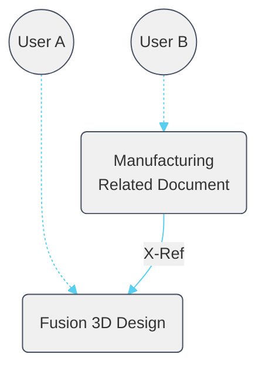
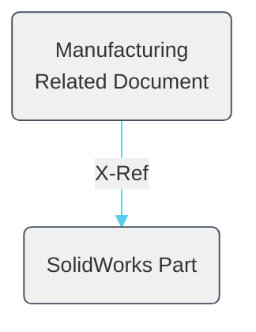
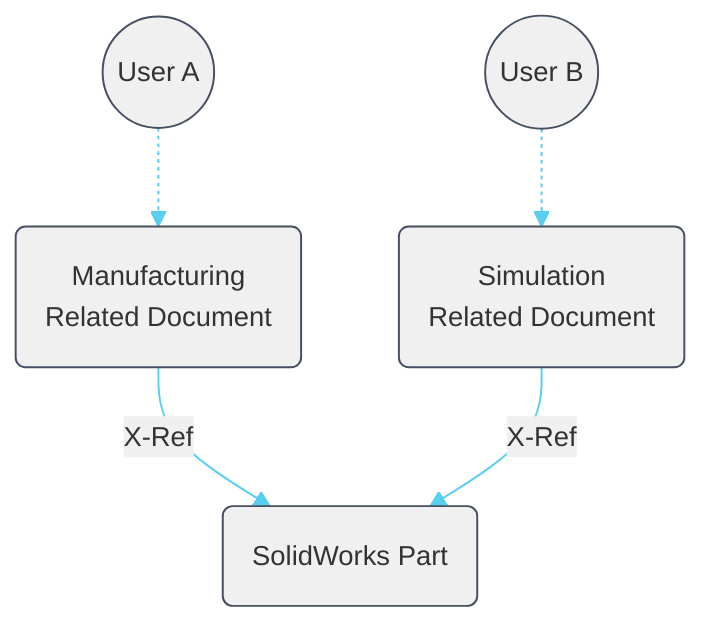
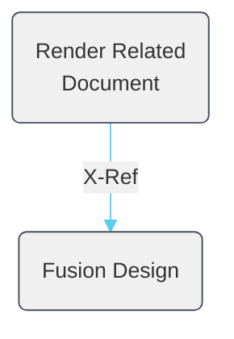
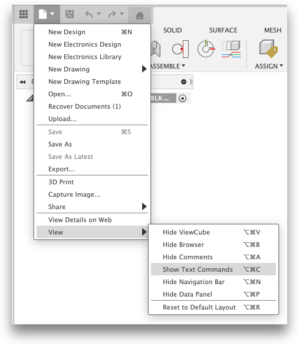
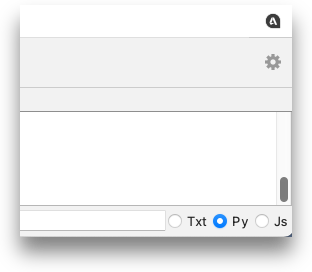
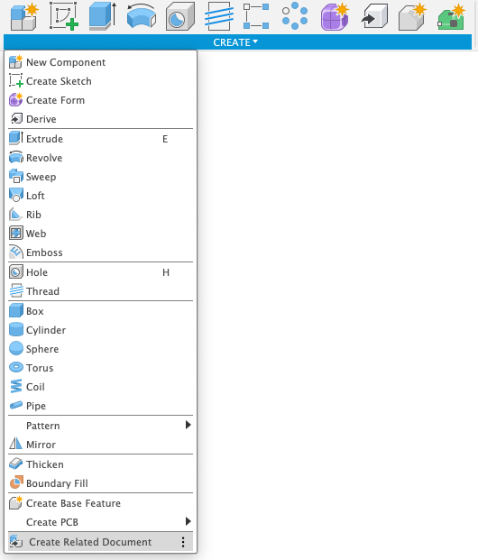
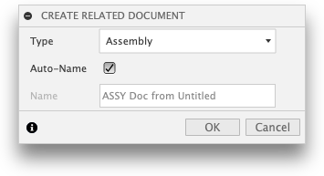
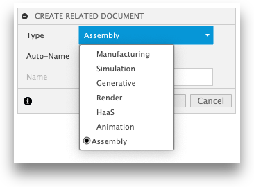

# Related Data

[Back to Readme](../README.md)

## Description

**WARNING** - Advanced Configuration required


When working as a team, with imported AnyCAD data, or on multiple manufacturing processes, it is useful to insert an existing source document into a new related document so that work can be done in the new related document and not change or lock the source (also called seed) document. This add-in creates a Design Workspace command that produces a new related document from a pre-configured list of saved start documents. Start documents are copied as a new document and then a reference the source document. The source document must be the active document and must be saved before this add-in's command can be used. If the document is not saved an error will instruct you to save first.  

When creating the new related document you may select from a configurable list of start documents. This allows you to have many start documents for different workflows. A common use case is to create workflows dor each discipline that may want to reference the seed document. Rather than create each discipline's data inside the seed document the discipline work is distributed into related documents.  For teams this prevents multiple users doing their discipline work fighting for write access tot the source design. IT also allows for permissions and lifecycle to be managed on each discipline separately. When creating a new related document the add-in pre-populates the name of the new related document to capture workflow and the name of the source document. This makes finding and understand why the new related document was created easier.

Here are a few examples for how you might use this add-in:  

**Manufacture a native Fusion 3D Design**
You have an existing Fusion Design and you want another team member to work on manufacturing setups and programming. By creating a related document that references the current design your team member can work in their own document without permission conflicts. In addition when you share your design you no longer have to share your private manufacturing information as it is store in its own document.  

In this graph we see how the add-in help create the Manufacturing Document referencing the Fusion Design you as **User A** working **Fusion 3D Design**. Tour team member as **User B** can work on the **Manufacturing Document** in parallel.  



**AnyCAD**
You have an existing SolidWorks document that you upload using Fusion 360 Team to your hub.

You can open this SolidWorks part in Fusion 360 Desktop client and then use this add-in to create a new referencing document for manufacturing and CNC programming.



Any changes to the SolidWorks part can saved and your manufacturing document will associatively update when you update the the new version.

> Note: AnyCAD workflows are only available when using a Team Hub and a Commercial, Education or Start UP Entitlement. Personal ( aka Free aka Hobby ) Entitlements do not have access to AnyCAD Workflows.

Later you may need to run FEA simulations on the same SolidWorks design. Using the add-in you can create a new related document referencing the SolidWorks AnyCAD part.



Two related documents have been created. One for Manufacturing and one for Simulation.
Each document can have a unique user working on it in parallel. This is very useful for teams to ensure you can have different discipline working on a design concurrently.

**Render designs with a common render setup**
Using the start document's ability to pre store information. You open a new empty document and activate the rendering workspace.
You can define new emissive bodies as lights and store several different options for floors. In addition you setup the render defaults for exposure, HDRI Environment map, background, and camera focal settings. Defining these in the start part ensure that as you make future renderings you can have consistent look and feel to you renderings.



## Start Documents

To  use this add-in, pre-create and save start documents that have information already defined in them. This allows you to automate and make smart start parts that can reduce setup for your intended workflows.
You can create a specific start document for each workflow and set the default naming scheme as you configure this add-in for your specific hub, team and use cases.

You can choose to save as much or as little information inside each start document. If you create start document for different disciplines, make sure the workspace for that discipline is active when you save. Fusion will honor that active workspace and your related data workflows will start in the right workspace automatically.

**TIP:** It its always useful to save a generic empty start document and configure a plain assembly or default start document option so you can always get a simple new reference assembly document when needed.


## Configuration

>**Note:** Creation of start parts, and their project folder is best done by a Fusion Team admin.

Open a web browser and log into [Fusion Team](https://www.autodesk.com/fusion-team). We need to create a Project to hold the start parts. This project needs to be available to all team members in your hub.  

I recommend you create a new project called **Templates**.

Set this project to be "Open" if using legacy project permissions. Ideally you have the newer folder-level permissions in Fusion Team. Add the **all users** group to the project.  

Create a **Start Parts** folder in the Templates project.

Create or copy Fusion documents into this folder. Create a new document for each workflow. Name each document a short name that is clear on the start part's purpose.

For example:

Document name | Purpose|
--------------|--------|
MFG - Haas.f3d| A document with, preselected machine, post, and fixtures and setup for a Haas CNC|
MFG - Plasma.f3d| A document with preselected machine, post, setup, and toolpath for a cnc plasma|
ASSY - in.f3d | A simple assembly in inches|
ASSY - mm.f3d | A simple assembly in mm|
VIZ.f3d | A render studio with custom lighting and stage elements like a floor|

### Setup the add-in for your custom start parts

The add-in needs to know where to find your start parts. We do this by creating a json file ( json is just a text file with a special extension and format).

This json need to contain two identifiers. One for you project and second for your folder of start parts.

The easiest way to find these is to open on start part that is in the specific project and folder you have setup above.

### How to find your own folder and project ID's

> **NOTE:** If you attempt to run the command without editing the settings as shown below, the add-in will throw an error.

Open the document you want to use as a start part.

From the application menu turn on the Text Command Pallet


Next, make sure you have "Py" turned on at the far right bottom of the **Text Commands** pallet.


In the text command pallet type:

```py
app=adsk.core.Application.get()
```

Next type:

```py
project=app.data.activeProject
```

Now type:

```py
project.id
```

Fusion will return the ID for the open active hub. Select this string and copy it using the Right Mouse Click menu. Copy the entire string "a.XXXXXX"

Now we get the folder for the open document. This is the folder where all your start documents ae stored. You only need to ensure one start document is open and the active document.

In the **Text Commands** pallet type:

```py
doc = app.activeDocument.dataFile.parentFolder.id
```

Then type:

```py
doc
```

Fusion will return the urn for the folder for active active document. Select this string and copy it using the Right Mouse Click menu. Copy the entire string "urn:XXXXXX"

You should see something like this in the **Text Commands** pallet:

```py
app=adsk.core.Application.get()

project=app.data.activeProject

project.id
a.1234ABCDERgh9101234ABCDERgh910

doc = app.activeDocument.dataFile.parentFolder.id

doc
urn:adsk.wipprod:fs.folder:co.1234ABCDERgh910
```

Open Smple Data.json located in the add-in install directory here:

>.\commands\relateddata\Sample data.json

Edit this and paste in your PROJECT_ID and FOLDER_ID as shown:

```json
{"PROJECT_ID":"_Paste your Project ID here_","FOLDER_ID":"_Paste your Folder ID here_"}
```

Your Json file should look like this:

```json
{"PROJECT_ID":"a.1234ABCDERgh9101234ABCDERgh910","FOLDER_ID":"urn:adsk.wipprod:fs.folder:co.1234ABCDERgh910"}

keeping in mind that your IDs will be different. **Use your IDsnot the values shown here.**
```

**Save the JSON file** and ensure you provide it to your team members.

Rename _Sample Data.json_ to _data.json_. **Case Matters**.

## You are now ready to use the Related Documents Add-In

When you first run the add-in it will index your specified folder and auto generate a docs.json file and save it to the add-in's folder locally. Indexing the cloud folder can take a few seconds and persisting this data will allow fusion to start faster.

If you add documents to the start parts folder you and all your team members should delete the docs.json that is auto-created when the add-in runs. This will force the add-in to recreate the documents json file with any changes as it will index the folder's documents and update. This check can take a few seconds or so.

**TIP:** If you save your start documents with the workspace you want to default to, this workspace will automatically be active when the document opens.

## Access

Once the Add-in is installed and running, you find the command in the Design Workspace -> Create Panel at the bottom of the menu.



You can add this command to your toolbar or "S Key" shortcuts.

Start the **Create Related Document** command. There will be a pause for a second or so as the list of documents is retrieved from your cloud Team Hub.



To select from the different start documents choose from the **Type** drop-down in the dialog displayed.



The new related document is auto-named by default. You can uncheck the **Auto-Name** option and define a name of your own.

Click **OK** and the new related document is created and your source document is inserted.


Thanks to contributions from:

- [TheEppicJR](https://github.com/TheEppicJR)

[Back to Readme](../README.md)

IMA LLC Copyright
